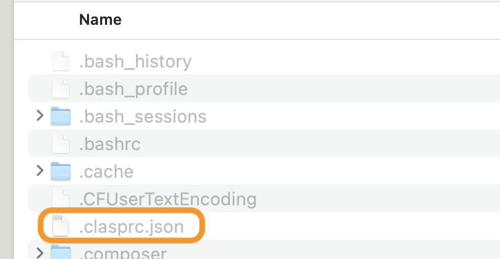

# prod-test-auto-management_1 (for Google Apps Script Projects)

## 目次

- [1. 概要](#1-概要)
- [2. セットアップ](#2-セットアップ)
- [3. 使用方法](#3-使用方法)
- [4. 参考文献](#4-参考文献)


## 1 概要

Google Apps Scriptプロジェクトのテスト環境と本番環境を一つのリポジトリで管理し、Github Actionsで本番環境に自動デプロイするワークフロー。(一つのプロジェクトの管理)

***複数プロジェクトを管理するGithub Actions Workflowsは[こちら](https://github.com/tsato21/prod-test-auto-management_2)。***

## 2 セットアップ

1. テスト用と本番用のApps Script fileをGoogle Driveで作成する。

2. ローカルリポジトリを以下の構成に設定する。
    ```
    ./
        └─ src/
        │ 
        │  
        └─ .clasp.json
        └─ .gitignore
    ```
- srcフォルダ傘下には、以降の作業でApps Scriptのファイルを格納する。

3. `.clasp.json`、`.gitignore`の内容を更新する。
    - `.clasp.json`
        ```
        {
        "scriptId": "XXXXX",
        "rootDir": "./src"
        }
        ```
      - `XXXXX`には、***テスト環境用ファイルのID***を入力。
    - `.gitignore`
        ```
        **/.clasp.json
        ```
      - テスト環境用ファイル情報はGit管理下から外す。

4. `npm install -g @google/clasp`でclaspをグローバルインストール。
- インストールしてない場合のみ。

5. `clasp login`でClaspにログイン
- ログインが成功したら、`/Users/ユーザー名/.clasprc.json`にDefault credentialsが保存される。(後の作業で使用する)

6. `clasp pull`で`src`フォルダに対象のApps Scriptファイル (テスト用) を格納する。
- `clasp pull`実施前に、必要に応じてテスト環境のコードを更新する。

7. Githubで新しいリポジトリを作成する。

8. Github SettingsでRepository Secretを設定。
- Github > Settings > Actions > Repository Secret
    
- 設定するSecret項目
  - CLASP_SCRIPT_ID: ***本番環境用ファイルのID***
  - CLASPRC_ACCESS_TOKEN: `clasprc.json`を参照
  - CLASPRC_CLIENT_ID: `clasprc.json`を参照
  - CLASPRC_CLIENT_SECRET: `clasprc.json`を参照
  - CLASPRC_EXPIRY_DATE: `clasprc.json`を参照
  - CLASPRC_ID_TOKEN: `clasprc.json`を参照
  - CLASPRC_REFRESH_TOKEN: `clasprc.json`を参照
    
- `clasprc.json`の参照方法 (Macの場合) : `/Users/ユーザー名/`にアクセスし、`command` + `shift` + `.`で隠しファイルを表示する。

9. Github Actions用のフォルダ、ファイル作成
- フォルダ、ファイル構成
    ```
    ./
        └─ .github/
             └─ workflows/
                └─ deploy.yml
    ```
- `deploy.yml`ファイルの内容は当該リポジトリを参照。
- `deploy.yml`で実施されるステップ
    - リポジトリをチェックアウト
    - Node.jsをセットアップ（バージョン16）
    - Nodeモジュールをキャッシュ
    - `~/.clasprc.json`を作成（Claspの設定ファイル）
    - `~/.clasp.json`を作成（本番環境プロジェクトに紐付けられたClaspの設定ファイル）
    - バージョン情報を取得
    - Google Apps Scriptプロジェクトのファイルをアップロード
    - Google Apps Scriptプロジェクトをデプロイ (Descriptionにタグ名を記載)
- ***タグ名が`v*`の形式でpushされたときに上記ステップが実行される。***

10. リポジトリの最初のCommit & Push
    ```
    git init
    git add .
    git commit -m "first commit"
    git branch -M main
    git remote add origin <リポジトリURL>
    git push -u origin main
    ```


***【オプション: package.jsonおよびpackage-lock.jsonを設定し、バージョン更新】***

11. `npm init -y`で`package.json`(デフォルト設定値)を作成する。必要に応じて内容更新。

12. `npm install`で`package-lock.json`を作成する。


## 3 使用方法
1. テスト環境用ファイルを最新の状態にする。(`/src`フォルダ傘下)

2. Commit & タグ付け & Push
    ```
    git add .
    git commit -m "XXX"
    git tag vX.X.X
    git push origin main
    git push origin vX.X.X
    ```
    - `vX.X.X`はSemantic Versioningに従い、記載。


***【オプション: package.jsonおよびpackage-lock.jsonを設定し、バージョン更新】***

3. `npm version X.X.X`をターミナルで実行
- npmのversionをgit tagと一致させることで、リポジトリ全体の一貫性を保てる。

## 4 参考文献
- [GitHub Actions を理解する](https://docs.github.com/ja/actions): 公式ドキュメント
- [アイデアからリリースまでのワークフローを自動化](https://github.co.jp/features/actions): 公式ドキュメント
- [GitHub Actionsを使ってGASをデプロイしてみた](https://dev.classmethod.jp/articles/github-actions-gas-deploy/): 参考サイト
- [gas-template](https://github.com/ttsukagoshi/gas-template): 参考Githubリポジトリ
- [Understanding Semantic Versioning: A Guide for Developers](https://www.linkedin.com/pulse/understanding-semantic-versioning-guide-developers-ajibola-oseni-/): 参考サイト


## 5 サンプル
- [Apps Script Projects](https://drive.google.com/drive/folders/13TZ4Zi3GqYLi78unHXvha1rVXjJBSPzn)