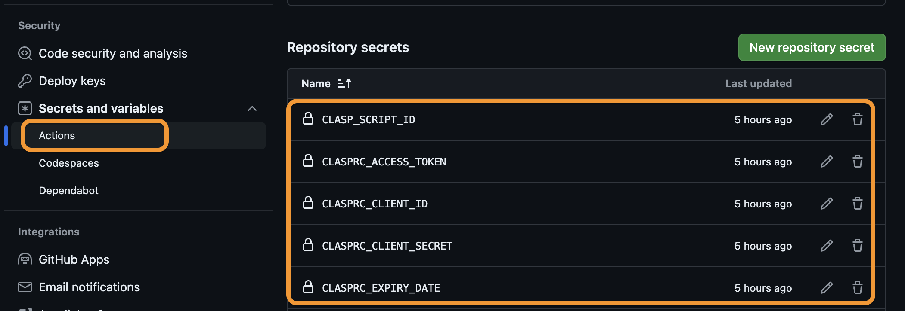

# prod-test-auto-management_1 (for Google Apps Script Projects)

## 目次

- [1. 概要](#1-概要)
- [2. セットアップ](#2-セットアップ)
- [3. 使用方法](#3-使用方法)
- [4. 参考文献](#4-参考文献)


## 1 概要

Google Apps Scriptプロジェクトのテスト環境と本番環境を一つのリポジトリで管理し、Github Actionsで本番環境に自動デプロイするワークフロー。


## 2 セットアップ

1. テスト用と本番用のApps Script fileをGoogle Driveで作成する。

2. ローカルリポジトリを以下の構成に設定する。
    ```
    ./
        └─ src/
        │ 
        │  
        └─ .clasp.json
        └─ .gitignore
    ```
- srcには、以降の作業でApps Scriptのファイルを格納する。
- `.gitignore`は必要に応じて設定。

3. `.clasp.json`の内容を更新する。
    ```
    {
    "scriptId": "XXXXX",
    "rootDir": "./src"
    }
    ```
    - scriptIdには、***テスト環境用ファイルのD***を入力。

4. `npm install -g @google/clasp`でclaspをグローバルインストール。(してない場合のみ)

5. `clasp login`でClaspにログイン
- ログインが成功したら、`/Users/ユーザー名/.clasprc.json`にDefault credentialsが保存される。

6. `clasp pull`で`src`フォルダに対象のApps Scriptファイルを格納する。

7. 必要に応じて、テスト環境でコーディングし、内容を更新。

8. Githubで新しいリポジトリを作成する。

9. Github > Settings > ActionsでRepository Secretを設定。
- 設定する項目
  - CLASP_SCRIPT_ID: ***本番環境用ファイルのID***
  - CLASPRC_ACCESS_TOKEN: `clasprc.json`を参照
  - CLASPRC_CLIENT_ID: `clasprc.json`を参照
  - CLASPRC_CLIENT_SECRET: `clasprc.json`を参照
  - CLASPRC_EXPIRY_DATE: `clasprc.json`を参照
  - CLASPRC_ID_TOKEN: `clasprc.json`を参照
  - CLASPRC_REFRESH_TOKEN: `clasprc.json`を参照
- `clasprc.json`の参照方法(Macの場合): `/Users/ユーザー名/`にアクセスし、`command` + `shift` + `.`で隠しファイルを表示する。
   
   

10. Github Actions用のフォルダ、ファイル作成
- フォルダ、ファイル構成
    ```
    ./
        └─ .github/
             └─ workflows/
                └─ deploy.yml
    ```
- `deploy.yml`は当該リポジトリを参照。
- `deploy.yml`で実施されるステップ
    - リポジトリをチェックアウト
    - Node.jsをセットアップ（バージョン16）
    - Nodeモジュールをキャッシュ
    - `~/.clasprc.json`を作成（Claspの設定ファイル）
    - `~/.clasp.json`を作成（特定のApps Scriptプロジェクトに関連付けられたClaspの設定ファイル）
    - バージョン情報を取得
    - Google Apps Scriptプロジェクトのファイルをアップロード
    - Google Apps Scriptプロジェクトをデプロイ (Descriptionにタグ名を記載)
- ***タグ名が`v*`の形式でpushされたときに上記ステップが実行される。***

11. リポジトリを最初のCommit & Push
    ```
    git init
    git add .
    git commit -m "first commit"
    git branch -M main
    git remote add origin <リポジトリURL>
    git push -u origin main
    ```

***【オプション: package.jsonおよびpackage-lock.jsonを設定し、バージョン更新】***

12. `npm init -y`で`package.json`(デフォルト値)を作成する。必要に応じてコード更新。

13. `npm install`で`package-lock.json`を作成する。


## 3 使用方法
1. テスト環境用ファイルを最新の状態にする。(`/src`フォルダ傘下)

2. Commit & タグ付け & Push
    ```
    git add .
    git commit -m "XXX"
    git tag vX.X.X
    git push origin main
    git push origin vX.X.X
    ```
    - `vX.X.X`はSemantic Versioningに従い、記載。

***【オプション: package.jsonおよびpackage-lock.jsonを設定し、バージョン更新】***

3. `npm version X.X.X`をターミナルで実行


## 4 参考文献